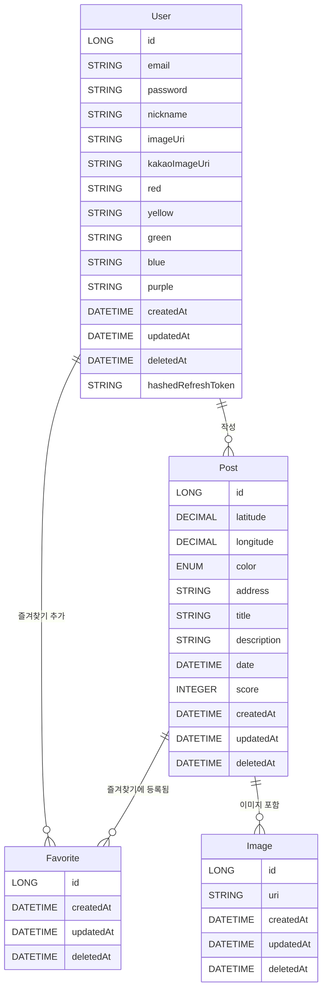
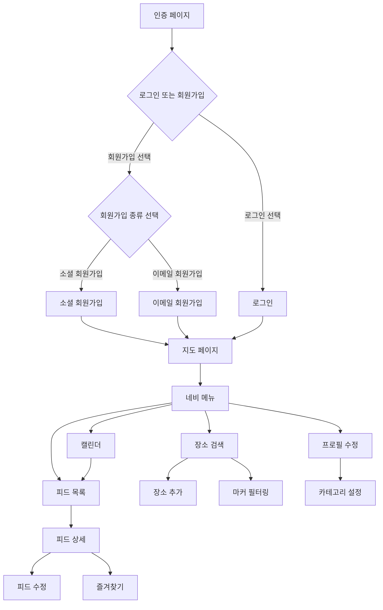
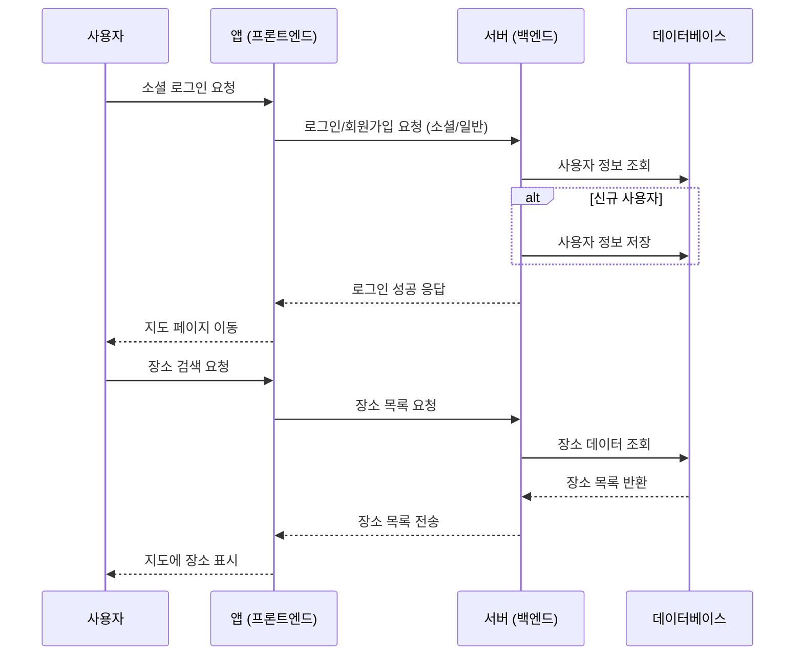

# 나만의 맛집 일기장 Foody
-  http:map-sv.site (예정)


## 1. 제작 기간 & 참여 인원

- 2025년 01월 31일 ~ 02월 07일 (예정)
- 개인 프로젝트


## 2. 사용 기술

#### `Back-end`

- Java 21
- Spring Boot 3.3.8
- Gradle
- Spring Data JPA
- postgresql


## 3. 도메인

```
 ─ domain
    ├─ auth          // 인증/인가
    ├─ favorite      // 즐겨찾기
    ├─ image         // 이미지
    ├─ post          // 게시글
```

## 4. 차트 & 다이어그램 설계

<details>
<summary><b style="cursor:pointer">ERD 설계</b></summary>
<div markdown="1">



</div>
</details>

<details>
<summary><b style="cursor:pointer">플로우 차트</b></summary>
<div markdown="2">



</div>
</details>

<details>
<summary><b style="cursor:pointer">시퀸스 다이어그램</b></summary>
<div markdown="3">



</div>
</details>

## 5. 핵심 기능

## 6. 프로젝트를 진행하며 고민한 Technical Issue

## 7. 트러블 슈팅

<details>
<summary style="cursor: pointer">스프링 프로젝트 시작 후 바로 종료(shutdown)</summary>
<div markdown="1">

- 문제 상황
```gradle
com.zaxxer.hikari.HikariDataSource : HikariPool-1 - Shutdown initiated.
```

- 해결
- 처음 의존성 설정 시 아래와 같은 의존성이 빠져 있었음
```gradle
implementation 'org.springframework.boot:spring-boot-starter-web'
```

</div>
</details>
